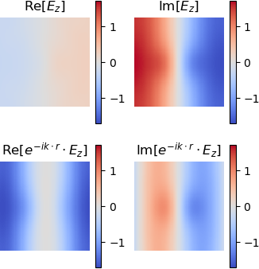

<div align="center">
</img>
</div>

## Introduction

`Peacock.jl` is a Julia package for studying photonic crystals.
* To do - explain why Peacock
    * The **P**lane-wave **A**pproach to **C**haracterising **O**ptical **C**rystals in **k**-space
* To do - list features here


## Example usage

Here we reproduce figures 2 and 3 from chapter 5 of _Photonic crystals: molding the flow of light_ by Joannopoulos (see further reading).

### Installation

The package can be installed using the built-in Julia package manager
```julia
using Pkg
Pkg.add("Peacock")
```

After installation, the package can be loaded in Julia
```julia
using Peacock
```


### Defining a photonic crystal in real space

A photonic crystal is defined using the `Geometry` constructor, which requires the optical properties of the crystal, lattice vectors, and resolution
```julia
# Permittivity
function epf(x,y)
    if x^2+y^2 < 0.2^2
        return 8.9
    else
        return 1
    end
end

# Permeability
function muf(x,y)
    return 1
end
    
# Lattice vectors
a1 = [1, 0]
a2 = [0, 1]

# Real-space resolution
d1 = d2 = 0.01

geometry = Geometry(epf, muf, a1, a2, d1, d2)
plot(geometry)
```
> 

### Defining the solver

The `Solver` approximates the geometry using a truncated Plane Wave Expansion (see further reading). The number of plane waves is determined by the cutoff. Increasing the cutoff will increase the accuracy of the solution, but low-contrast photonic crystals can be well approximated with a relatively low number of plane waves.

```julia
fourier_space_cutoff = 7
solver = Solver(geometry, fourier_space_cutoff)
plot(solver)
```
> 


### Plotting the band structure of a photonic crystal

* Plotting band structure
    * Defining Brillouin zone coordinates

```julia
G = BrillouinZoneCoordinate(  0,   0, "Γ")
X = BrillouinZoneCoordinate(1/2,   0, "X")
M = BrillouinZoneCoordinate(1/2, 1/2, "M")
k_path = [G,X,M,G]

figure(figsize=(4,3))
plot_band_diagram(solver, k_path, TE, color="red",
            bands=1:4, dk=0.1, frequency_scale=1/2pi)
plot_band_diagram(solver, k_path, TM, color="blue",
            bands=1:4, dk=0.1, frequency_scale=1/2pi)
ylim(0,0.8)
```
> 


### Plotting the modes

```julia
frequencies, modes = solve(solver, X, TM)
plot(modes[2], bloch_phase=true)
plot(modes[2], bloch_phase=false)
```

> 


### The `Peacock.Zoo` submodule

```julia
using Peacock.Zoo
using Parameters

# Load photonic topological insulator from Wu et al 2015
@unpack geometry, solver, polarisation, G, K, M = make_wu_topo(fourier_space_cutoff)

# Preview the crystal
plot(geometry)
```

> 

```julia
# Plot the first six bands
figure(figsize=(3,4))
plot_band_diagram(solver, [K,G,M], polarisation,
        bands=1:6, frequency_scale=1/2pi, dk=0.1)
```

> 


## Further reading

Photonic crystals - Joannaopoulos
http://ab-initio.mit.edu/book/

Methodology - Rumpf CEM
